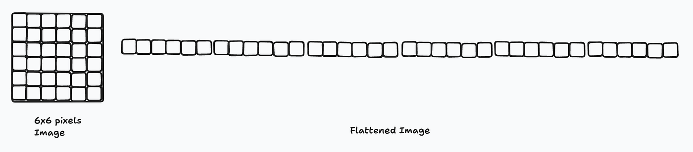
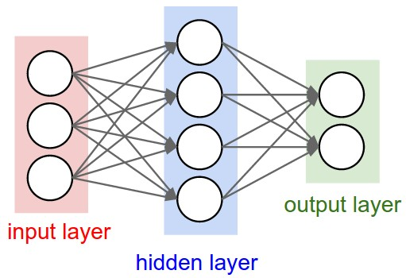
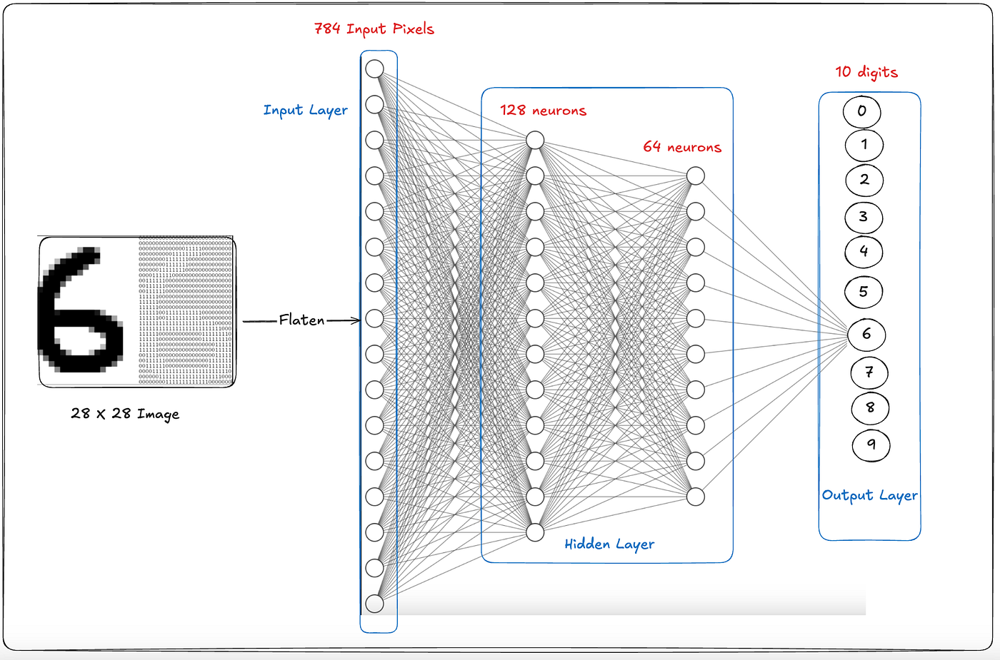

# Deep Learning Concepts — Study Notes

Personal notes made while learning the fundamentals of neural networks, before building the ANN and CNN projects in this repo.

---

### 1. Neuron — The Tiny Brain Cell of a Neural Network

- The human brain has neurons.

- - Deep learning also uses artificial neurons.

- A neuron’s job is:

- - ✅ Take input
- - ✅ Give importance to inputs using weights
- - ✅ Produce an output (decision)


### Real-Life Example

- Suppose you are deciding:

- -  “Should I go play cricket tomorrow or not?”

- Inputs:

- - Weather = good
- - Homework = too much
- - Friends available = yes

- - Your brain combines all this information and makes a decision.

- A neural network neuron works in the same way.


### Neuron Formula

- A neuron basically does this:

- - Output = ( Input × Weights ) + Bias

- Then it applies an activation function.


### Simple Example

- Inputs:

- - [2,3]

- Weights:

- - [ 4 , 5 ]

- Multiply:

- - ( 2 × 4 ) + ( 3 × 5 )
- -  8 + 15 = 23

- Add bias:

- - 23 + 1 = 24

- - Neuron output = 24


### What is Bias?

- Bias is an extra adjustment value.

- - Like giving “bonus marks.”

- - Visual Idea
- - - Input --> Neuron --> Output


_______________________________________________________________________________________________________________________________________


### 2. Layer — A Group of Neurons

- One neuron alone is not very smart.

- - Many neurons together create a powerful system.

- - - These groups are called layers.

### Neural Network Structure

- - Input Layer --> Hidden Layer --> Output Layer


#### Input Layer

- Receives the data.

- Example:
- - Image pixels.

#### Hidden Layer

- This is where actual learning happens.

- - It learns patterns such as:

- - - eyes
- - - nose
- - - shapes
- - - edges

#### Output Layer

- - Gives the final answer.

- - Example:

 - - - Cat = 95%
 - - - Dog = 5%
 - - - Real-Life Example

### Suppose AI wants to detect a cat.

#### Input Layer

- Looks at image pixels.

#### Hidden Layer

- Learns features like:

- - ears
- - whiskers
- - eyes

#### Output Layer

- Makes the final decision:

- - “This is a cat.”

### Deep Neural Network

- If there are many hidden layers:

- - Input --> Hidden --> Hidden --> Hidden --> Output

- - - It is called Deep Learning.


____________________________________________________________________________________________________________________________________


### 3. Activation Functions — The Decision Maker

#### Very Important 🔥

- The activation function decides:

- - “Should this neuron activate or not?”

- Problem Without Activation

- - Without activation functions:

- - The neural network would only do simple linear math.

- - It would not learn smart or complex patterns.

- Activation = Brain’s Switch
- - Useful signal? --> ON
- - Useless signal? --> OFF


### Most Important Activation Functions
#### - A
- ReLU (Most Common 🔥)

- - Formula:

- - - f(x)=max(0,x)

- Meaning:

- - Negative number → 0
- - Positive number → stays the same

- Example
______________________________________

- - Input : −5

- - Output : 0
____________________
- - Input : 7

- - Output : 7
___________________ 

- Visual
- - -5 --> 0
- - 2 --> 2
- - 10 --> 10
___________________
- Why is ReLU Famous?

- - ✅ Fast
- - ✅ Simple
- - ✅ Works very well in deep networks

- That’s why modern AI mostly uses ReLU.


### B) Sigmoid

- Output range:

- - 0 to 1
- Example
------------------------
- Input: 100

-  Output ≈ 0.99
__________________________________________________

- Input: −100

- Output ≈ 0.01
_____________________________________________________

- Why is Sigmoid Useful?

- - It gives probability-like outputs.

- - Example:

- - - Cat probability = 0.95

- Visual Idea
- - Big positive --> close to 1
- - Big negative --> close to 0


## Relu Vs Sigmoid 

| Feature        | ReLU                  | Sigmoid               |
| -------------- | --------------------- | --------------------- |
| Full Name      | Rectified Linear Unit | Sigmoid Function      |
| Formula        | `max(0, x)`           | `1 / (1 + e^-x)`      |
| Output Range   | `0 → ∞`               | `0 → 1`               |
| Negative Input | Turns it into 0       | Gives a small value   |
| Positive Input | Keeps the same value  | Pushes it close to 1  |
| Speed          | Fast                  | Slow                  |
| Mostly Used In | Hidden layers         | Output layer          |
| Best For       | Learning features     | Giving probability    |
| Classification | Hidden learning       | Binary classification |
| Regression     | Hidden layers         | Usually not used      |
| Deep Networks  | Very good             | Weak in deep networks |


- - 
__________________________________________________________________________________________________

 


# Phase 4 Your First Neural Network (MNIST Digit Recognition)
_____________________________________


### Now we will build a real neural network 🔥

#### Goal:

- ✅ Understand how a neural network works
- ❌ Perfect accuracy is not necessary

- - We will use:

- - - TensorFlow
- - - Keras

- Keras is one of the easiest libraries for beginners.


- 🧠 What Will This Project Do?

- The computer will learn to recognize handwritten digits:

- - - 0 1 2 3 4 5 6 7 8 9

- - The dataset is called:

- - MNIST


### 📦 Step 1 — Install TensorFlow

#### Run this in the terminal:

- - pip install tensorflow


#### Step 2 — Full Beginner Code


```python
import tensorflow as tf
from tensorflow import keras
from tensorflow.keras import layers

# Load dataset
(x_train, y_train), (x_test, y_test) = keras.datasets.mnist.load_data()
```

```python
# Normalize data (0-255 → 0-1)
x_train = x_train / 255.0
x_test = x_test / 255.0
```

```python
# Build neural network
model = keras.Sequential([
    
    # Input layer
    layers.Flatten(input_shape=(28, 28)),
    
    # Hidden layer
    layers.Dense(128, activation='relu'),
    
    # Output layer
    layers.Dense(10, activation='softmax')
])


```

```python
# Compile model
model.compile(
    optimizer='adam',
    loss='sparse_categorical_crossentropy',
    metrics=['accuracy']
)

```

```python
# Train model
model.fit(x_train, y_train, epochs=5)

```

```python
# Test model
test_loss, test_acc = model.evaluate(x_test, y_test)

print("Test Accuracy:", test_acc)
```

### 🔥 Understanding the Code

- Loading the Dataset

- - (x_train, y_train), (x_test, y_test)

- Meaning

| Variable | Meaning         |
| -------- | --------------- |
| x_train  | Training images |
| y_train  | Correct labels  |
| x_test   | Testing images  |
| y_test   | Testing labels  |


- 🖼 MNIST Images

- - Each image is:

- - - 28 × 28 pixels

- - These are black-and-white digit images.


### ⚡ Normalize Data

- x_train = x_train / 255.0

- Image pixel values are:

- - 0 → 255

- We convert them to:

- 0 → 1

This helps the model train better.


### 🧠 Neural Network Architecture

- keras.Sequential([...])

- - Sequential means:

- - - Layer by layer


### 🔹 Flatten Layer

-  layers.Flatten(input_shape=(28,28))

- - The image:

- - - 28 × 28

- - is converted into:

- - - 784 numbers

- because:

- 28 × 28 = 784




#### 🔥 Hidden Layer

- layers.Dense(128, activation='relu')

- - Meaning:

- - - 128 neurons
- - - ReLU activation

- This layer learns patterns such as:

- - curves
- - edges
- - digit shapes




#### 🎯 Output Layer

- layers.Dense(10, activation='softmax')

- - - Why 10?

- - Because there are digits:

- - - 0–9

- - - So there are 10 classes in total.

- ❓ What Is Softmax?

- - Softmax gives probabilities.

- Example:

- - Digit 0 → 2%
- - Digit 1 → 1%
- - Digit 7 → 95%

-  The highest probability becomes the prediction.




#### ⚙ Compile Step

- optimizer='adam'

- - The optimizer helps the network learn better.

-  Loss Function
- - sparse_categorical_crossentropy

- This tells the model:

- - how wrong the prediction is


### Training

- model.fit(...)

- - This is the actual learning step.

- - The network:

- - ✅ makes mistakes
- - ✅ adjusts weights
- - ✅ keeps improving

- 🔁 Epochs
- - epochs=5

- Meaning:

- - The model sees the full dataset 5 times.


### 🧪 Testing

- model.evaluate(...)

- - This checks:

- - - how well the model learned


## 🚀 Tiny Homework

- Experiment with:

- - Dense(64)
- - Dense(256)
- - epochs=10

and see how the accuracy changes.

